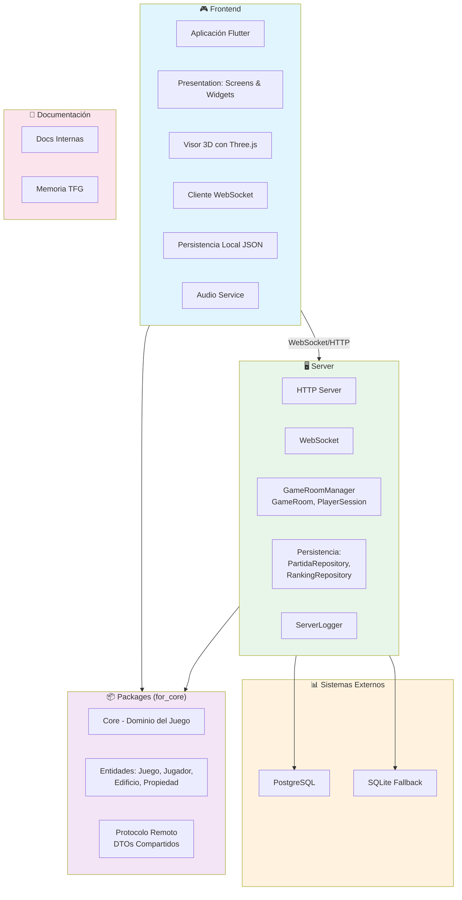
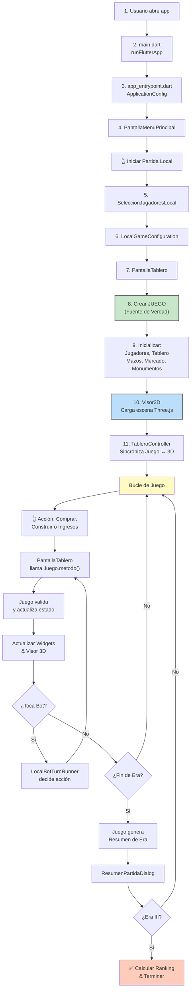
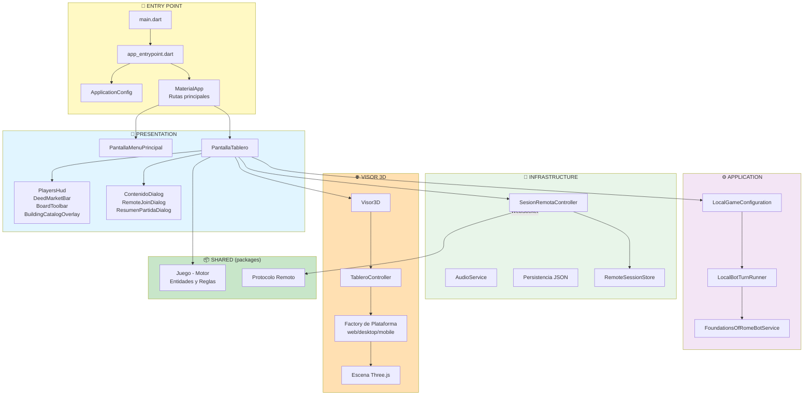
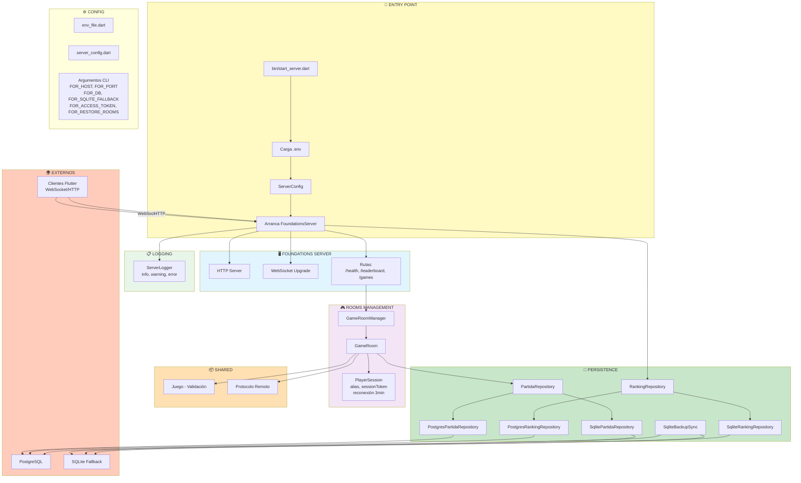
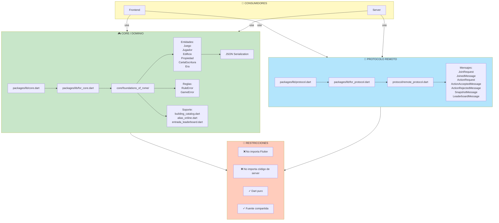
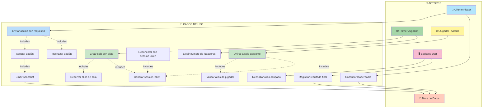
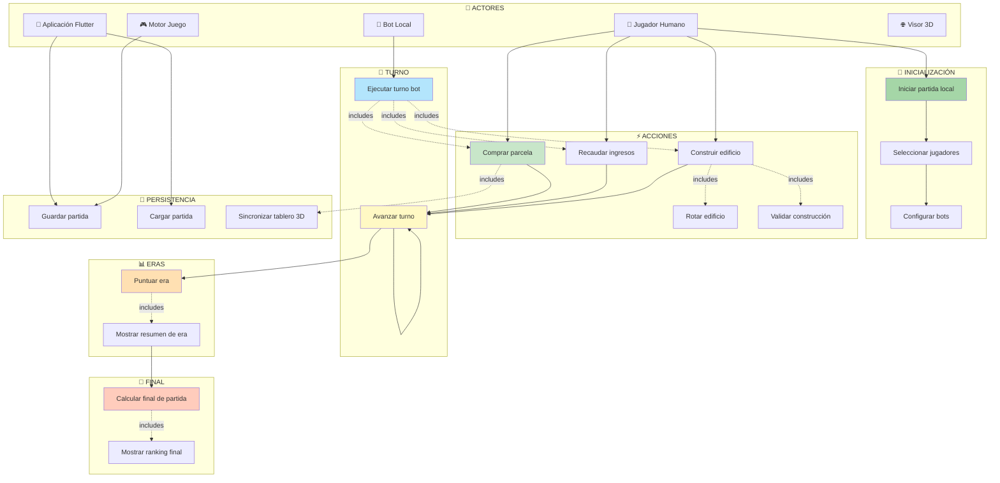

# Diagramas Mermaid - Foundations of Rome Digital

Diagramas de arquitectura, flujos y casos de uso en formato Mermaid para visualizar con la extensión "Markdown Preview Mermaid Support".

Para visualizar: `Cmd+Shift+V` en VS Code

---

## 1. Arquitectura General del Monorepo



**Nota Clave:** El cliente nunca accede directamente a la base de datos. Todo pasa por el servidor.

---

## 2. Flujo de Datos - Partida Local



**Tres zonas principales:**
- 🎨 **Interfaz Flutter:** Widgets y screens
- 🎮 **Dominio (Juego):** Motor de reglas (fuente de verdad)
- 🌐 **Visor 3D:** Visualización con Three.js

---

## 3. Flujo de Datos - Acción Remota (Secuencia)

```mermaid
sequenceDiagram
    actor Player as 👤 Jugador
    participant UI as PantallaTablero
    participant Remote as SesionRemotaController
    participant WS as WebSocket
    participant Server as FoundationsServer
    participant Room as GameRoom
    participant Game as Juego<br/>packages
    participant Repo as PartidaRepository
    participant Clients as Otros Clientes
    
    Player->>UI: 👆 Compra/Construye/Ingresos
    Note over UI: Modo remoto: NO modifica Juego localmente
    
    UI->>Remote: ActionRequest
    Note over Remote: requestId = UUID
    
    Remote->>WS: Envía por WebSocket
    WS->>Server: Mensaje JSON
    Server->>Room: Entrega a GameRoom
    
    Room->>Room: ✓ Valida turno, jugador, sessionToken
    Room->>Game: Ejecuta acción
    
    Note over Game: Juego valida reglas
    alt Acción válida
        Game-->>Room: ✓ OK
        Room->>Repo: Guarda evento + snapshot
        Room->>WS: actionAccepted (requestId)
        WS->>Remote: Mensaje confirmación
        Remote->>UI: Actualiza estado
        Room->>Clients: Envía snapshot a todos
        Clients->>Clients: Reconstruyen Juego desde JSON
    else Acción inválida
        Game-->>Room: ✗ GameError
        Room->>WS: actionRejected (requestId, reason)
        WS->>Remote: Mensaje rechazo
        Remote->>UI: Muestra error
    end
    
    UI->>UI: Actualiza HUD, mercado,<br/>tablero y visor 3D
    UI-->>Player: ✅ Resultado

    style Game fill:#c8e6c9
    style Room fill:#b3e5fc
    style Remote fill:#ffe0b2
```

**Flujos:**
- ✅ **Éxito:** `actionAccepted` + snapshot → todos actualizan
- ❌ **Error:** `actionRejected` + motivo → UI muestra error

**El servidor es la autoridad en modo remoto**

---

## 4. Arquitectura - Módulo Frontend



**Nota:** "La UI no contiene reglas de juego; muestra estado y delega acciones"

---

## 5. Arquitectura - Módulo Server



**Nota:** "El servidor es la autoridad de la partida remota"

---

## 6. Arquitectura - Módulo Packages (for_core)



**Restricciones de diseño:**
- Sin Flutter
- Sin código de server
- Dart puro (portable)
- Fuente única de verdad

---

## 7. Casos de Uso - Modo Remoto



**Nota:** "El alias identifica al jugador visualmente; la identidad de reconexión es el sessionToken"

---

## 8. Casos de Uso - Partida Local



**Nota:** "Todas las acciones legales pasan por Juego; la UI no duplica reglas"

